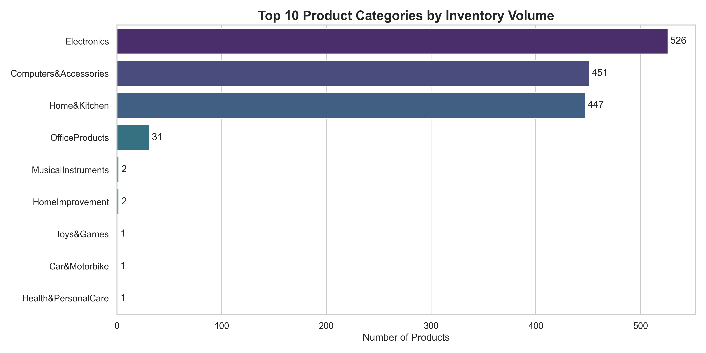
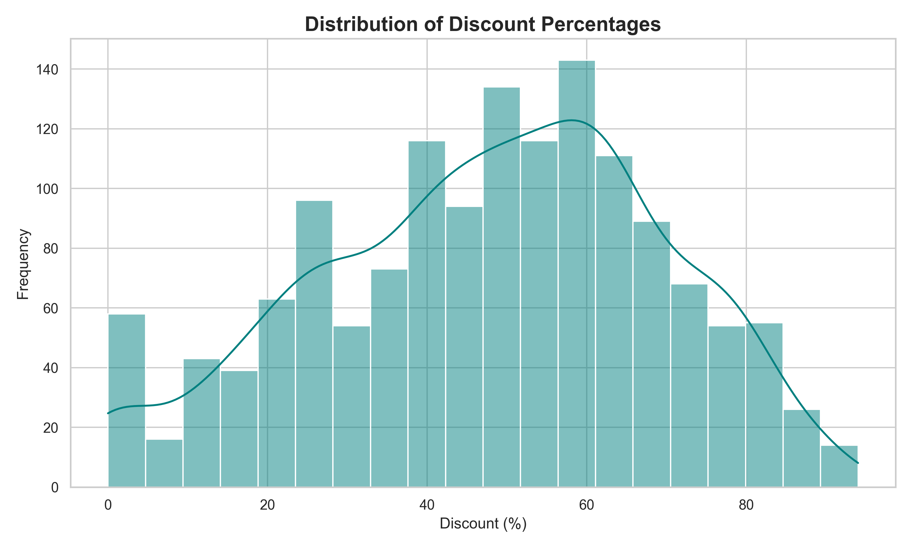
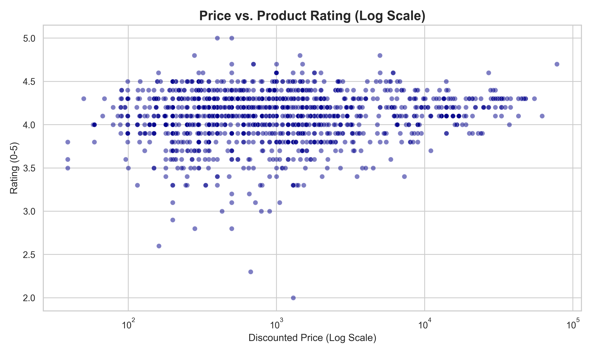

# Amazon Sales Strategy Analysis 📊

## Project Overview
In the competitive e-commerce landscape, pricing strategies directly impact sales volume and customer satisfaction. This project analyzes a dataset of over **1,400 Amazon products** to determine the relationship between discounting, pricing, and customer ratings.

**The goal:** To identify whether "deep discounting" is a viable strategy for maintaining high customer satisfaction and to pinpoint the most competitive product categories.

---

## 🔍 Key Business Insights

### 1. The "High-Discount" Illusion
* **Observation:** The average discount across the inventory is **47.6%**, with many products discounted over 50%.
* **Insight:** Sellers use a "High Markup, High Discount" psychological pricing strategy to make deals appear more attractive.

### 2. Price vs. Satisfaction Anomaly
* **Observation:** There is **zero correlation** between the price of a product and its user rating.
* **Insight:** Customers do not rate expensive products higher. Value perception is driven by product utility, not the price tag.

### 3. Review Reliability Warning
* **Observation:** The average rating is **4.1/5.0**, which is statistically skewed.
* **Insight:** This indicates a strong "Survivorship Bias" (poorly rated products are removed) or potential review curation.

---

## 📊 Visual Analysis

### Category Dominance
*The inventory is heavily skewed towards Electronics and Home/Kitchen appliances, making these the most competitive niches.*


### Discount Distribution
*Most products offer a discount between 30% and 60%, creating a standard expectation for customers.*


### Price Elasticity & Ratings
*As shown below, high prices do not guarantee high ratings. Quality control is more critical than premium pricing.*


---

## 💡 Recommendations
Based on the data, the following strategies are recommended for new sellers:
1.  **Avoid Price Wars:** Since price doesn't drive ratings, focus on product quality and detailed descriptions rather than just lowering the price.
2.  **Entry Strategy:** "Electronics" is oversaturated. Niche categories (like Office Products or Toys) may offer better visibility for new entrants.
3.  **Discounting:** A discount of **30-50%** is the industry standard. Anything less may be perceived as "expensive" by the algorithm-conditioned customer.

---

## 🛠️ Technical Details
* **Language:** Python 3.10+
* **Libraries:** Pandas (Data Manipulation), Seaborn/Matplotlib (Visualization)
* **Data Processing:** * Cleaned currency symbols (`₹`) and percentage formatting.
    * Handled missing values to ensure statistical significance.
    * Log-scaled pricing data for accurate visualization.

## 🚀 Getting Started
To replicate this analysis:

1.  Clone the repository.
2.  Install requirements:
    ```bash
    pip install -r requirements.txt
    ```
3.  Run the script:
    ```bash
    python notebooks/analysis.py
    ```